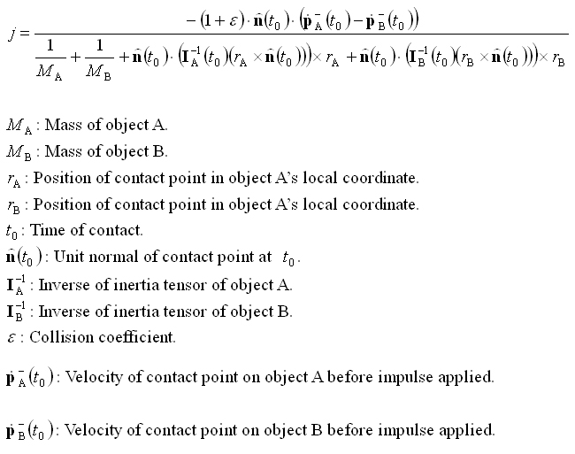

# Physical Dynamics using OBB

This demo simulates the visually (not physically) correct response of rigid bodies, using OBB as bounding volume.  It can be divided into two parts: 1) Collision detection between OBBs. 2) Non-penetration constraints among OBBs.  When two OBBs are found to be inter-penetrated, a restoring force (penalty) will be applied to both objects, so that  they adhere the non-penetration constraints.  I implemented the Separating Axis Theorem (SAT), from Gottschalk's work [1],  to handle the collision detection of OBBs and the  non-penetration constraint equation presented by David Baraff [2] for two bodies in colliding contact.

In our case, as the intersection test is between two OBBs, according SAT, there are 15 possible directions for the separating axis: Nx_a, Ny_a, Nz_a, Nx_b, Ny_b, Nz_b, CrossProduct(Nx_a, Nx_b), CrossProduct(Nx_a, Ny_b), CrossProduct(Nx_a, Nz_b), CrossProduct(Ny_a, Nx_b), CrossProduct(Ny_a, Ny_b), CrossProduct(Ny_a, Nz_b), CrossProduct(Nz_a, Nx_b), CrossProduct(Nz_a, Ny_b) and CrossProduct(Nz_a, Nz_b).  If no separating axis exists in such directions, the OBB is intersecting with another OBB, so am impulse between them has to be applied at the point of contact.  Its direction is following the normal vector at the contact point and its amplitude can be solved using the equation below:

   

In fact, this work still has a lot going to be improved, such as having a more accurate edge-to-edge contact point detection, a higher numerical stability to reduce object explosion and a hierarchical OBB tree for more accurate collision detection.  In addition, the codes are still under reviewing, so please forgive me for the messy codes this time!

[1] Gottschalk, S., M.C. Lin and D. Manocha, "OBBTree: A Hierarchical Structure for Ripid Interference Detection", Computer Graphics (SIGGRAPH 96 Proceedings), pp. 171-180, August 1996.

[2] David Baraff, "An Introduction to Physically Based Modelling: Rigid Body Simulation II - Nonpenetration Constraints", SIGGRAPH 97 Course Notes, 1997.